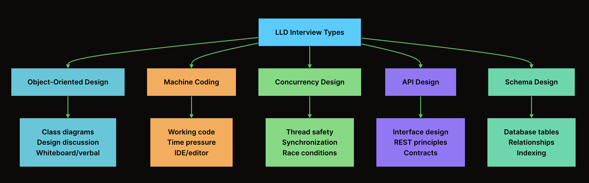

## Intro to LLD
- HLD answers: "What components do we need and how do they communicate?"
- LLD answers: "How do we actually implement each component?"

## LLD
- What are the specific classes, and what are their responsibilities?
- What are the attributes and methods of each class?
- How do these classes relate to each other (inheritance, composition)?
- What design patterns are most suitable (e.g., Factory, Singleton, Strategy)?
- What are the specific method signatures, including parameters, return types, and exceptions?

## Where LLD Fits in the Development Process
- Requirements -> HLD -> LLD -> Code Implementation

## Key relationships include:
- Association: A general "uses-a" relationship. A Doctor uses a Stethoscope.
- Aggregation (Weak "has-a"): An object contains other objects, but they can exist independently. A Department has Professors. If the department is closed, the professors still exist.
- Composition (Strong "has-a"): An object is composed of other objects, and their lifecycles are tied. A House is composed of Rooms. If you demolish the house, the rooms are destroyed with it.
- Inheritance ("is-a"): A class inherits properties and behaviors from a parent. A Car is a Vehicle.

## Types of LLD Interviews


## What Interviewers Evaluate - OOD

| Skill | Weight | What They Look For |
| --- | --- | --- |
| OOP Fundamentals | High | Proper use of inheritance, encapsulation, polymorphism |
| Design Patterns | High | Recognizing when patterns fit naturally |
| SOLID Principles | High | Single responsibility, open/closed, etc. |
| Communication | High | Explaining decisions, responding to feedback |
| Trade-off Discussion | Medium | Justifying choices, considering alternatives |

## What Interviewers Evaluate - Machine Coding

| Skill | Weight | What They Look For |
| --- | --- | --- |
| Coding Speed | High | Can you implement under time pressure? |
| Code Quality | High | Can you write clean, readable, maintainable code? |
| Correctness | High | Does your code work for given test cases? |
| Testing | High | Writing test cases or driver code |
| Project Structure | Medium | Using proper packages, separation of concerns |
| Edge Cases | Medium | Handling invalid inputs gracefully |

## How to Identify Your Interview Type
- “What type of LLD round should I expect?”
- “Will this be whiteboard-style discussion, or will I code in an IDE?”
- “How long is the LLD round?”
- “Should I expect concurrency topics like race conditions or deadlocks?”
- “Will there be any database or schema design in this round?”


### Classes and Objects
- Classes is blueprint.
- Object is instance of class.

eg:
```
class Car:
	def __init__(self, brand, model):
		self._brand = brand
		self._model = model
		self._speed = 0

	def accelerate(self, increment):
		self._speed+=increment


	def display_status(self):
		print(f"Brand {self._brand} 's model {self._model} is running at {self._speed} km/h.")


if __name__ == "__main__":
	corolla = Car("Toyota", "Corolla")
	mustang = Car("Ford", "Mustang")
	corolla.display_status()
	corolla.accelerate(20)
	corolla.display_status()
```

## Enum
- Fixed Set of Named Constants.
- Avoids Magic Values
- Improves Readability
```
eg 1:
from enum import Enum
class OrderStatus(Enum):
    PLACED = "PLACED"
    CONFIRMED = "CONFIRMED"
    SHIPPED = "SHIPPED"

----------------------------------
eg 2:
class Coin(Enum):
    PENNY = 1

output: Coin.PENNY.get_value() 

```

## Interfaces
-  An interface is a contract: a list of methods that any implementing class must provide.
- Defines what a component should do, not how it should do it.
- Plays a foundational role in building systems that are extensible, testable, and loosely coupled
```
from abc import ABC, abstractmethod

class PaymentGateway(ABC):
@abstractmethod
def initiate_payment(self, amount):
    pass

------------------------------------------

class StripePayment(PaymentGateway):
    def initiate_payment(self, amount):
        print(f"Processing payment via Stripe")


class RazorPayment(PaymentGateway):
    def initiate_payment(self, amount):
        print(f"Processing payment via Razorpay")

-------------------------------------------------------

- CheckoutService takes a PaymentGateway, not a StripePayment. This single decision is what decouples the service from any specific provider.

class CheckoutService:
    def __init__(self, payment_gateway):
        self.payment_gateway = payment_gateway
    
    def set_payment_gateway(self, payment_gateway):
        self.payment_gateway = payment_gateway
    
    def checkout(self, amount):
        self.payment_gateway.initiate_payment(amount)

```
## Encapsulation
- Grouping data and behaviour that operate on data into a single unit and restricting direct access to internal details of that class.
- Hiding internal complexity and exposing only what’s necessary.
- The general rule is simple: make everything private by default, then selectively expose what needs to be public.
```


class Product:
    def __init__(self, name: str, price: float):
        self.__name = name
        self.__price = price

    @property
    def name(self) -> str:
        return self.__name
    
    @property
    def price(self) -> float:
        return self.__price
    

    @price.setter
    def price(self, value: float) -> None:
        print(f"Setting price to {value}")
        if value < 0:
            raise ValueError("Price can't be negative")
        self.__price = value

apple = Product("Apple", 1.5)
print(apple.name)
print(apple.price)
apple.price = 2.0
print(apple.price)
```
```
Eg: 2
class PaymentProcessor:
    def __init__(self, cardNumber: str):
        self.__cardNumber = self.__maskedCardNumber(cardNumber)

    
    def __maskedCardNumber(self, cardNumber: str) -> str:
        return "**** **** **** " + cardNumber[-4:]
    
    def processsPayment(self, amount: float) -> None:
        print(f"Processing payment of ${amount:.2f} using card ${self.__cardNumber}")
        return None
    

stripe = PaymentProcessor("1234567812345678")
stripe.processsPayment(100.00)
```

## Abstraction
- Process of hiding complex impl details and exposing only relevant high level functionality to outside world.
- Focus on what an object does , rather than how it does it.
- Extend Without Modifying
- Share Common Logic Once
    - eg: every logger needs to prepend timestamp and log level
    - without abstraction, you'd duplicate that formatting logic in each conditional branch or in each standalone class.

- abstract classes are different from interfaces: they let you share behavior, not just a contract.

| Aspect | Encapsulation | Abstraction |
| --- | --- | --- |
| Focus | Protecting data within a class | Hiding implementation complexity |
| Goal | Restrict access to internal state | Simplify usage and expose only essentials |
| Level | Implementation-level | Design-level |
| Example | Private balance field in BankAccount | Exposing only deposit() and withdraw() without showing how they work |

```
eg: logger

from abc import ABC, abstractmethod
from datetime import datetime

class Logger(ABC):
    def __init__(self, level:str):
        self._level = level
    
    @abstractmethod
    def log(self, message: str) -> None:
        pass


    def format_message(self, message: str) -> str:
        timestamp = datetime.now().strftime("%Y-%m-%d %H:%M:%S")
        return f"[{timestamp}] [{self._level}] {message}"


class ConsoleLogger(Logger):
    def __init__(self, level: str):
        super().__init__(level)

    def log(self, message: str) -> None:
        print(self.format_message(message))


C = ConsoleLogger("info")
C.log("This is a demo")
```

## Inheritance
- Inheritance allows one class (called the subclass or child class) to inherit the properties and behaviors of another class
- Single Inheritance, Multiple Inheritance, Multilevel Inheritance, Hierarchial inheritance
- User Inheritance when:
    - There is a clear "is-a" relationship
    - Want to promote code reuse through shared logic and structure
- Avoid inheritance when:
    - The relationship is "has-a" or "uses-a" rather than "is-a".

```
from datetime import datetime


class Notification:
    def __init__(self, recipient:str, message: str):
        self.__recipient = recipient
        self.__message = message
        self.__timestamp = datetime.now().strftime('%Y-%m-%d %H:%M:%S')

    def format_header(self, recipient: str) -> str:
        return f"[{self.__timestamp}] - To - {recipient} "
    
    def send(self):
        print(self.format_header(self.__recipient))
        print("Sending Notification....+ " + self.__message)


class EmailNotification(Notification):
    def __init__(self, recipient: str, message: str, subject: str):
        super().__init__(recipient, message)
        self.__subject = subject

    def send(self):
        print("Sending Email Notification....+ " + self._Notification__message)
        print("Subject: " + self.__subject)

if __name__ == "__main__":
    gmail = EmailNotification("nitinkumar21038@gmail.com", "yoyo", "Test Subject")
    gmail.send()
```


## Polymorphism
- Polymorphism allows the same method name or interface to exhibit different behaviors depending on the object that is invoking it.
- Compile-time Polymorphism (method overloading)
    - multiple methods with the same name in the same class but with different parameter lists.

```
# Python does NOT support method overloading natively.
# If you define multiple methods with the same name, only the last one survives.
# The standard workaround is to use default arguments or *args.

class Calculator:
    def add(self, *args):
        return sum(args)


calc = Calculator()
print(calc.add(2, 3))        # 5
print(calc.add(2.5, 3.5))    # 6.0
print(calc.add(1, 2, 3))     # 6

```

- RunTime Polymorphism (Overriding)
    - It happens when a child class overrides a method in its parent class and decision of which
      version to call is made at runtime.

```
class Notification:
    def __init__(self, recipient: str, message: str):
        self._recipient = recipient
        self._message = message

    def send(self):
        print(f"Sending generic notification to {self._recipient}")


class EmailNotification(Notification):
    def __init__(self, recipient: str, message: str, subject: str):
        super().__init__(recipient, message)
        self._subject = subject

    def send(self):
        print(f"Sending EMAIL to {self._recipient} | Subject: {self._subject}")


class SMSNotification(Notification):
    def __init__(self, recipient: str, message: str, phone_number: str):
        super().__init__(recipient, message)
        self._phone_number = phone_number

    def send(self):
        print(f"Sending SMS to {self._phone_number} | Message: {self._message}")

if __name__ == "__main__":
    notifications = [
        EmailNotification("alice@example.com", "Your order shipped!", "Order Update"),
        SMSNotification("Bob", "Code: 482910", "+1-555-0123"),
    ]

    for n in notifications:
        n.send()

```

# Class Relationships
## Association 
- Association reflects a "has-a" or "uses-a" relationship.
- Associated objects are loosely coupled and can exist independently of one another.
- represented by ------ (straight line) in UML Diagram
- eg: A student has-a teacher who teaches them.

## Aggregation
- It's often described as a "has-a" relationship where the whole does not control the part's lifecycle
- One class (the "whole") contains references to other class objects (the "parts"), but the parts can exist independently of the whole.
- The hollow diamond (o--) on the Playlist side is the UML notation for aggregation. It signals that Playlist is the "whole" and Song is the "part," but the songs are not owned by the playlist.
- eg: Playlist has-a Song
- Uses:
    - Promotes Reusability
    - Improves Flexibility
    - Reflects real world relationships

## Composition
- It represents the strongest form of "has-a" relationship, where the whole owns the parts and controls their lifecycle.
- composition is represented by a filled diamond (◆) at the “whole” end of the relationship
- when to use compisition:
    - is the part meaningless without the whole
    - should the whole control the parts's lifecycle
- avoids tight coupling we can swap out parts dynamically to modify behaviour

Think of it like this:
- Association is a general connection: two classes simply know about each other.
- Aggregation is a grouping: the whole and parts can exist independently.
- Composition is an ownership: the part’s existence is bound to the whole.

## Dependency
- 